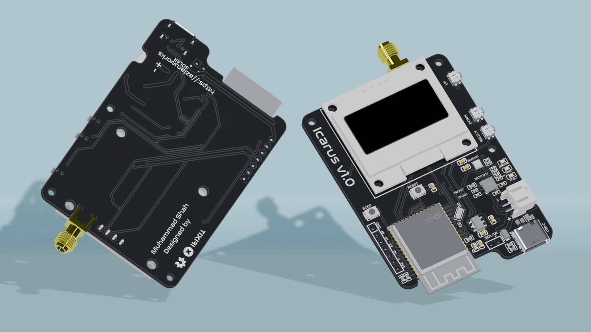

# Overview

Here is a brief overview of this project! This is my custom ESP32-S3 based Meshtastic PCB. Below is a list of features my board supports:

- USB-C
- OLED SSD106 1.3"
- ESP32-S3(N8R8)
- 3-Button input
- LiPo Charging + Loadsharing with MCP73871
- LoRa RA-01SH for 868MHz
- BME280 for Temperature, Humidity and Barometric Pressure
- Additional exposed GPIO for expansion